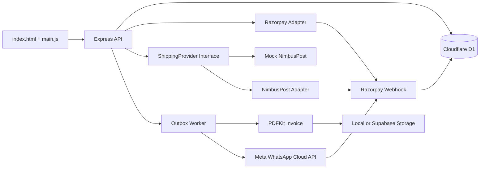

# CRUNCHH Commerce

CRUNCHH is now a Node.js + TypeScript commerce application that preserves the existing static storefront while adding secure server-side checkout, Razorpay payments, mock/real shipping adapters, invoice generation, WhatsApp notifications, admin tools, and an outbox retry queue.

## Architecture Overview

The browser only sends customer details, address fields, product slugs, quantities, payment method, and WhatsApp consent. The server reloads products from Cloudflare D1 in production, recalculates every amount in integer paise, reserves inventory server-side, and drives fulfilment through idempotent webhooks and outbox jobs.



## Local Installation

```bash
npm install
cp .env.example .env
```

For Cloudflare production, create a D1 database and set `DATABASE_PROVIDER=d1`, `CLOUDFLARE_ACCOUNT_ID`, `CLOUDFLARE_D1_DATABASE_ID`, and `CLOUDFLARE_D1_API_TOKEN`.

For non-Cloudflare hosting only, set `DATABASE_PROVIDER=postgres`, `DATABASE_URL`, and `DIRECT_URL`.

## Database Migration

```bash
npm run prisma:generate
npm run d1:migrate
npm run db:seed
```

For production:

```bash
npm run d1:migrate
npm run db:seed
```

## Product Seeding

`prisma/seed.ts` seeds the six 80 g CRUNCHH products with paise pricing:

- Stick Crunchh: `14900`
- Lotus Crunchh: `17500`
- Ruby Crunchh: `15900`
- Leafy Crunchh: `15900`
- Fusion Crunchh: `15900`
- Puff Crunchh: `13900`

## Run Locally

```bash
npm run dev
```

Open `http://localhost:3000`. In development, if Razorpay keys are missing, the frontend uses `/api/dev/mock-razorpay/capture`. That endpoint is blocked in production.

## Razorpay Test Setup

1. Create or log in to Razorpay Dashboard.
2. Switch to Test Mode.
3. Go to Account & Settings > API Keys.
4. Generate a key pair.
5. Put `RAZORPAY_KEY_ID` and `RAZORPAY_KEY_SECRET` in `.env`.
6. Start the server and place a prepaid order.
7. Use Razorpay test payment instruments.

## Razorpay Live Setup

1. Complete Razorpay account activation and KYC.
2. Switch to Live Mode.
3. Generate live API keys.
4. Set `RAZORPAY_KEY_ID`, `RAZORPAY_KEY_SECRET`, and `RAZORPAY_AUTO_CAPTURE`.
5. Confirm settlement, refund, and auto-capture settings with operations.

## Razorpay Webhook Configuration

1. Dashboard > Account & Settings > Webhooks.
2. Add endpoint: `https://crunchh.store/api/webhooks/razorpay`.
3. Enable at least `payment.captured`, `payment.failed`, `order.paid`, and refund events.
4. Generate a webhook secret and set `RAZORPAY_WEBHOOK_SECRET`.
5. Send a test webhook and verify it creates a `WebhookEvent`.

Sample:

```bash
curl -X POST http://localhost:3000/api/webhooks/razorpay \
  -H "content-type: application/json" \
  -H "x-razorpay-signature: dev-valid-signature" \
  --data @tests/fixtures/razorpay-payment-captured.json
```

## NimbusPost Credential Generation

Use the NimbusPost seller panel or merchant support channel to request merchant API access. Add only documented credential fields to `.env`: email/password, API key/secret, pickup location, return location, and webhook secret or route token.

## NimbusPost Adapter Mapping

The real adapter is in `src/services/nimbuspost/nimbuspost-provider.ts`. Endpoint paths are configuration-driven:

- `NIMBUSPOST_AUTH_PATH`
- `NIMBUSPOST_SERVICEABILITY_PATH`
- `NIMBUSPOST_RATES_PATH`
- `NIMBUSPOST_CREATE_SHIPMENT_PATH`
- `NIMBUSPOST_TRACKING_PATH`
- `NIMBUSPOST_CANCEL_PATH`
- `NIMBUSPOST_LABEL_PATH`

The request mapping lives in `src/services/nimbuspost/mapping.ts`. Do not enable `SHIPPING_PROVIDER=nimbuspost` and `NIMBUSPOST_MOCK_MODE=false` until the official merchant API documentation has been mapped field-by-field.

## NimbusPost Webhook Configuration

Use `POST /api/webhooks/nimbuspost/:token` when NimbusPost does not provide signatures. Set a long random `NIMBUSPOST_WEBHOOK_ROUTE_TOKEN`. If NimbusPost supports a shared secret signature, set `NIMBUSPOST_WEBHOOK_SECRET` and map the exact signature header.

Sample:

```bash
curl -X POST http://localhost:3000/api/webhooks/nimbuspost/dev-token \
  -H "content-type: application/json" \
  --data @tests/fixtures/nimbuspost-tracking.json
```

## Meta WhatsApp Cloud API Setup

1. Create a Meta Business portfolio.
2. Add WhatsApp Business Platform.
3. Connect the CRUNCHH phone number.
4. Create a permanent or system-user access token.
5. Set `WHATSAPP_ACCESS_TOKEN`, `WHATSAPP_PHONE_NUMBER_ID`, `WHATSAPP_BUSINESS_ACCOUNT_ID`, `WHATSAPP_APP_SECRET`, and `WHATSAPP_WEBHOOK_VERIFY_TOKEN`.
6. Configure webhooks:
   - Verify: `GET /api/webhooks/whatsapp`
   - Events: `POST /api/webhooks/whatsapp`

## WhatsApp Utility Template Submission

Submit an approved utility template named `crunchh_order_confirmed`.

Body concept:

```text
Hi {{1}}, your CRUNCHH order {{2}} has been confirmed.

Amount: {{3}}
Payment: {{4}}
Courier: {{5}}
AWB: {{6}}

Track your order here:
{{7}}

Har Mood Ka Crunch Code.
```

Use a document header for invoice PDF where approved. Configure fallback template `WHATSAPP_FALLBACK_ORDER_CONFIRMED_TEMPLATE` for text-only confirmations.

## Supabase Setup

Supabase is now optional. Cloudflare production uses D1 for relational data and R2 for private invoice PDFs. Use Supabase only if deploying the optional Postgres path outside Cloudflare.

## Admin Setup

Generate a bcrypt hash:

```bash
node -e "require('bcryptjs').hash('replace-this-password', 12).then(console.log)"
```

Set `ADMIN_EMAIL` and `ADMIN_PASSWORD_HASH`, run `npm run db:seed`, then open `/admin`.

The admin login email is stored in the `AdminUser` table and authentication reads from that table only. To change the login email, update the `AdminUser.email` row directly in D1/PostgreSQL; there is no public UI route that can change admin identity.

Admin APIs support:

- sales dashboard with revenue, order count, AOV, payment mix, pending shipment, pending invoice, and WhatsApp failure metrics
- order search by order ID, mobile, AWB, and payment ID
- CSV export
- retry shipment, invoice, and WhatsApp jobs
- inventory management for stock, active status, and product paise price
- outbox, webhook, and WhatsApp notification logs
- guarded cancellation placeholder that does not trigger refunds

## Deployment

Use Cloudflare Containers for live deployment. See `CLOUDFLARE_DEPLOYMENT.md` for the full step-by-step launch guide.

Docker locally:

```bash
docker build -t crunchh-commerce .
docker run --env-file .env -p 3000:3000 crunchh-commerce
```

Render/Railway:

- Build: `npm install && npx prisma generate && npm run build`
- Start: `npm run start:prod`
- Health: `/health`
- Readiness: `/ready`

## Testing

```bash
npm test
npm run build
```

The current runnable suite covers server pricing, inactive product rejection, Razorpay signatures, mobile normalization, COD mapping, mock AWB generation, centralized tracking status mapping, idempotency constraints, invoice access protection, admin auth guards, and production mock-payment blocking.

Full end-to-end tests require a reachable D1 database or local D1 emulator state and should be added to CI before launch.

## Production Checklist

See `PRODUCTION_CHECKLIST.md`. The invoice format and tax configuration must be reviewed by the company's accountant before production use.

## Troubleshooting

- Payment verified but no shipment: check `OutboxJob` rows for `BOOK_SHIPMENT`.
- Shipment booked but no invoice: retry `GENERATE_INVOICE` from admin.
- Invoice exists but WhatsApp failed: retry `SEND_WHATSAPP_ORDER_CONFIRMED`; do not cancel the paid order.
- NimbusPost errors in production: verify exact endpoint paths and mapping against merchant API docs.
- Readiness fails: check database connectivity and mock-mode flags.

## Manual Recovery

1. Locate the order by public order ID in admin.
2. Check payment status against Razorpay Dashboard.
3. If paid and no AWB, retry shipment booking.
4. If AWB exists and no invoice, retry invoice generation.
5. If invoice exists and WhatsApp failed, retry WhatsApp.
6. For cancellation, cancel shipment in NimbusPost seller panel first, then update internal state manually after confirming no refund was unintentionally issued.
